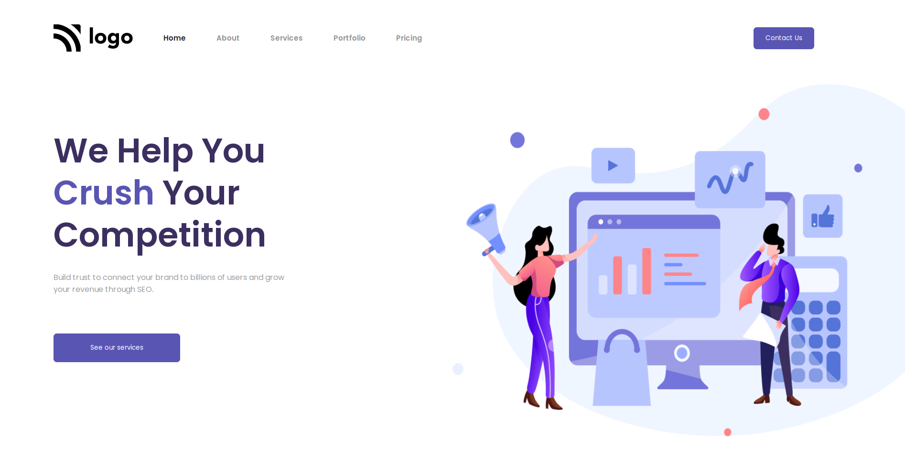

# Project 4

## `Nishok Maharaaj`

## Learnings   

This is the fourth project in the HTML and CSS class where I learnt how to work with SVG's and illustrations.

## Efforts

This project took approximately one hour to complete.

### Screenshot

